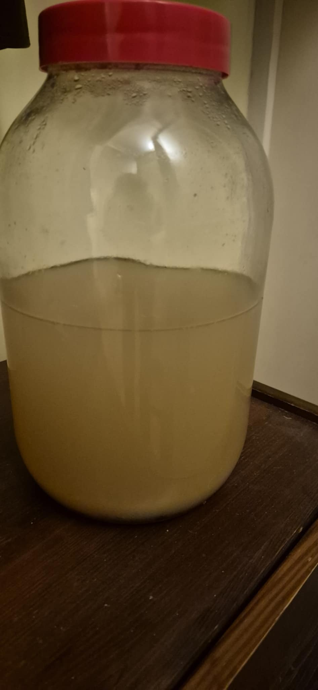
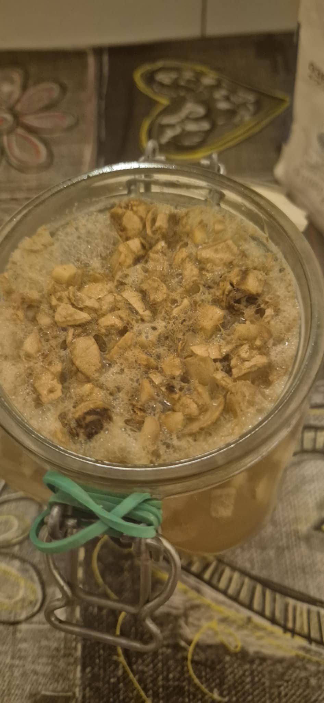
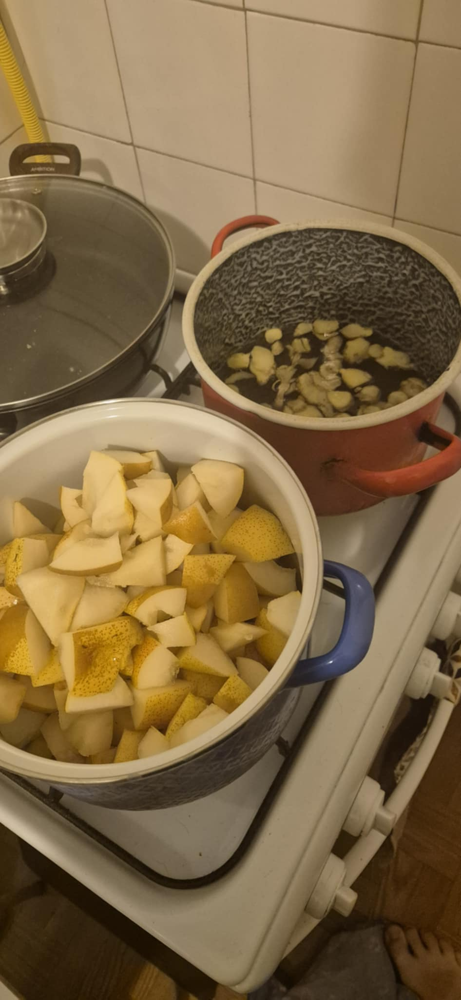
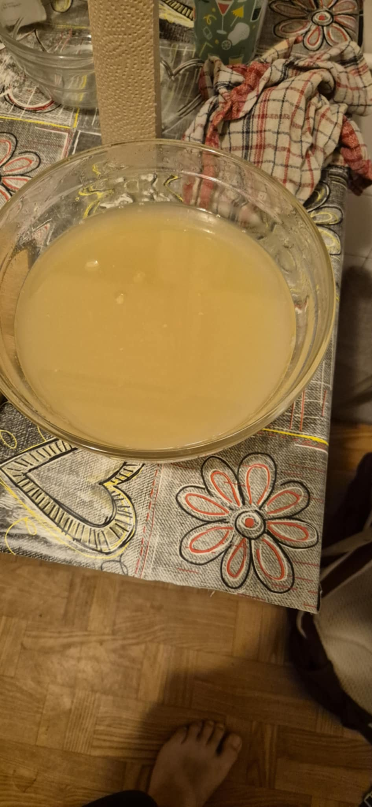

-- Starting date:   2025/10/27
-- Finishing date:  -
-- Status:          Ongoing
-- Last updated:    2025/10/27 

# Pear ginger-bug cider
The plan is to make a simple ginger bug based pear cider around 4-5% abv.

## Ingredients

- Ginger tea 
    - 600ml filtered water
    - 60g   ginger
    - 350g  white sugar

- Pear-apple mash
    - 8     pears
    - 2     apples
    - 600ml filtered water
    - 1     lemon

- 160ml Ginger bug

- 600ml water

In the end I've got ~3l liquid before starting the ferment.

## Process

### Ginger tea

Cut up the ginger into slices, and boil it with the rest of the ingredients, for 10 minutes. After that wait for it to cool for another 10-15 minutes, and get the ginger bits out.

### Pear-apple mash

Core and cut up pears and apples into small chunks, cook it with 600ml water till really soft (took me about 30 minutes). Mash it (I did it with a potato masher) and than get the solids out of the liquid, and wait for it to cool to room temp.

## Fermentation diary

### Starting ginger bug

This is how it looked, it was nice and tangy, and really active, just fed it the day before using it.

### Fermentation

- 2025/10/28 9PM - A little bubbling, a little vomit smell, added another half a lemon to it, and stirred it vigorosly, hopefully the smell will disapate after some time

## Notes

- Always have a plan for the fruit pulp and rest of the discards (I made pear butter from the pulp, which was great!)
- Look into alcohol based sanitizer, working with boiling water is not that fun

